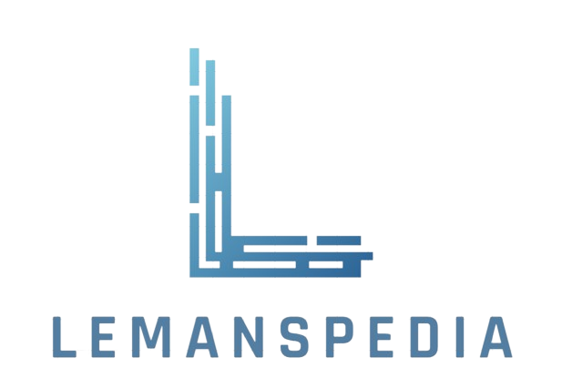
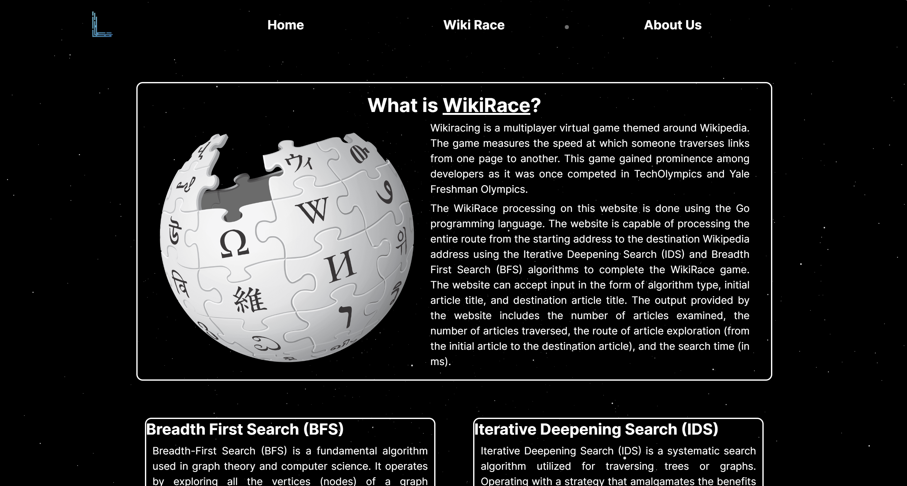
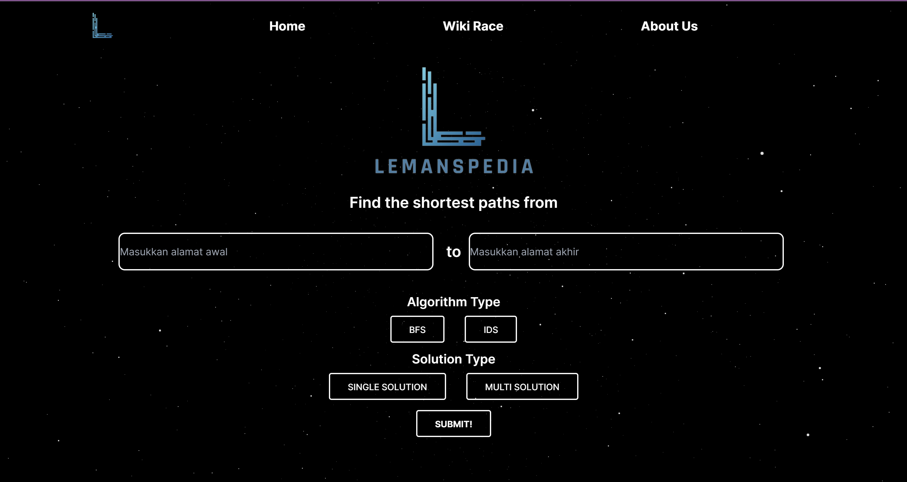
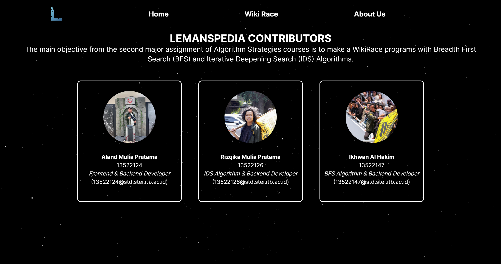

<div align="center">
  
</div>

# 🏎️🏁 LemansPedia: Wiki Race Program 

> 🌐 Web-Based Wiki Race Program by using BFS and IDS Algorithms

🎓 **Project Background:**
I created the Wiki Race Website Program named "LemansPedia" as part of my Algorithm Strategies second major assignment during my fourth semester in the Computer Science program at ITB.

## 🪪 Contributors
| Nama | NIM |
|---|---|
| Aland Mulia Pratama | 13522124 |
| Rizqika Mulia Pratama | 13522126 |
| Ikhwan Al Hakim | 13522147 |

## 📝 Description
WikiRace, or the Wiki Game, is a game inspired by the structure of Wikipedia, an online encyclopedia collaboratively managed by thousands of volunteers worldwide. The game challenges players to navigate through the network of Wikipedia articles with the goal of reaching a predetermined article as quickly as possible or using the fewest number of clicks.

## 📁 Project Structure
```bash
Tubes2_MarthenGantenk
├── backend
│   ├── bfs.go
│   ├── ids.go
│   └── main.go
├── frontend
│   ├── app
│   ├── components
│   ├── public
│   └── jsconfig.json, next.config.mjs, package-lock.json, package.json, postcss.config.js
├── doc
└── README
```

## Configuration Guide

### Front-End Setup:
1. Clone the repository to your local files. Access the repository [here](repository-link).
2. Open the terminal and ensure that the directory is set to `Tubes2_MarthenGantenk/frontend`.
3. Run `npm install` to activate the React-JS framework and any dependencies needed by the website locally.
4. Execute `npm run dev`.

### Back-End Configuration:
1. Make sure to install GO Programming Language. You can access the GO Programming Language Installer [here](https://go.dev/doc/install). Make sure to add PATH during installation on your device.
2. After the GO Programming Language is successfully installed, change the directory to `Tubes2_MarthenGantenk/backend`.
3. Run the backend by executing `go run .` below.

## How to Run
1. Access the Wiki Race website page at http://localhost:3000/wiki-race.
2. Enter the starting address and the destination address of the article website. Inputs can be made manually or using the autocomplete feature.
3. After that, you can select the type of algorithm (BFS/IDS) and also the type of solution (Single Solution/Multi Solution). Inputs cannot be submitted until you have chosen both the type of algorithm and the type of solution.
4. Once everything has been verified as correct, you can press the submit button and wait for the results of the shortest route from the starting address to the final address of the Wikipedia article.

## Screenshots

<div align="center">
  
  <p><i>Home Page</i></p>
</div>

<div align="center">
  
  <p><i>Wiki Race Page</i></p>
</div>

<div align="center">
  
  <p><i>About Us Page</i></p>
</div>